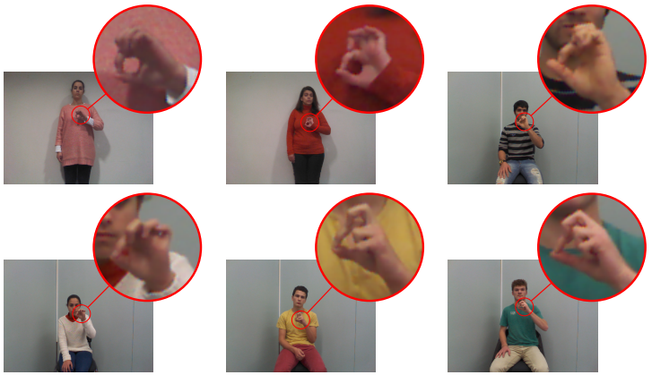

# SI-PSL database
Signer-Independent Portuguese Sign Language (SI-PSL) database

## Overview

The SI-PSL database was specially created for signer-independent evaluation purposes. It contains 31 isolated signs, representing the alphabet and the cardinal numbers 0 to 9 of the Portuguese sign language. All the signs were performed three times by a total of 11 native signers, in a free and natural signing environment, without any clothing restriction but with a slightly-controlled uniform background (see Figure below). Therefore, it clearly depicts the large inter-signer variability that exists in the manual signing process of sign languages. The proposed SI-PSL is made publicly available for benchmark purposes, in order to foster the signer-independent SLR research.

## Data and annotations

The images of the SI-PSL are 8-bit RGB color images with a resolution of 640x480 pixels. Each image of the database has a corresponding annotation file with the bounding box coordinates of the hands. 

## Evaluation protocol

The SI-PSL database has a well-defined standard evaluation protocol, which consists of:

- 6 signers for training;
- 1 signer for validation;
- 4 signers foe test.

## Terms of use

The data included in the SI-PSL database can be used for research and educational purposes. It is important to note that redistribution and commercial use is not allowed. 

All publications that make use of this dataset must cite the following paper:

P. M. Ferreira, D. Pernes, A. Rebelo and J. S. Cardoso, "**[DeSIRe: Deep Signer-Invariant Representations for Sign Language Recognition](https://ieeexplore.ieee.org/abstract/document/8937777)**", *in IEEE Transactions on Systems, Man, and Cybernetics: Systems*.
doi: 10.1109/TSMC.2019.2957347

## Get acess to the database

The entire SI-PSL database is already freely available to the research community for benchmark purposes. 

If you want to have acess to SI-PSL please send us an email to pmm@inesctec.pt

